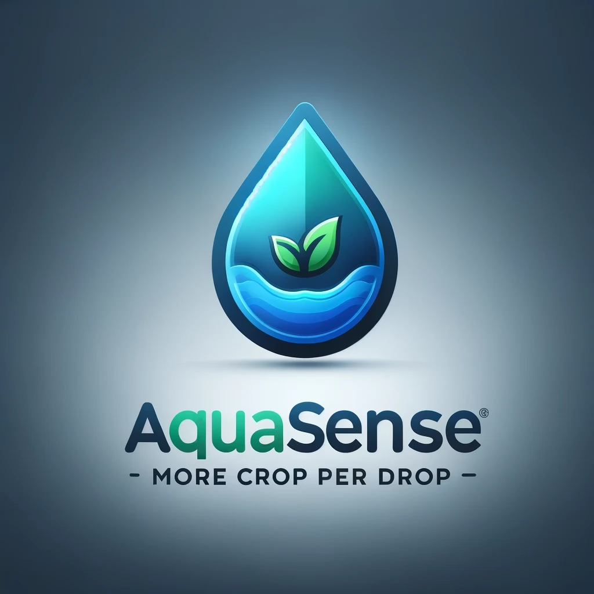
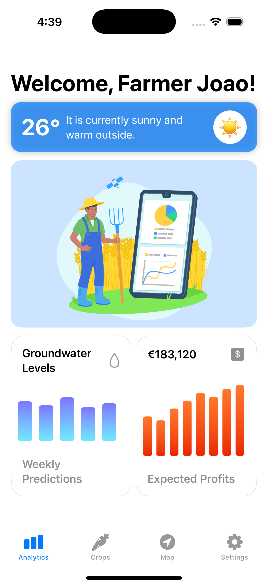

# AquaSense: Groundwater Level Prediction for Sustainable Agriculture

## Overview

AquaSense is an innovative iOS application designed to empower small and medium-sized farmers in France with advanced groundwater level predictions and agricultural insights. Leveraging machine learning and comprehensive data analysis, the app helps farmers make informed decisions about crop selection and water management in the face of increasing climate challenges.

## Problem Statement

Climate change is significantly impacting agricultural water resources in France:
- 36-40% of agricultural water needs come from groundwater
- Increasing drought conditions threaten agricultural sustainability
- Farmers lack reliable tools to predict water availability and optimize crop selection

## Key Features

### 1. Groundwater Prediction
- Real-time groundwater level predictions based on:
  - Farmer's specific location
  - Integrated weather API data
  - Machine learning predictive modeling

### 2. Crop Profit Analysis
- Comprehensive crop recommendation system
- Calculates:
  - Hardiness zone assessment
  - Additional water requirements
  - Water cost projections
  - Seed and growing expenses
- Provides clear, actionable recommendations for most profitable crops

## Technical Architecture

- Machine Learning Model
- Weather API Integration
- Crop Database Management
- User-Friendly Interface

---

## Groundwater Prediction Model

### Dataset
Our groundwater prediction model is trained on a comprehensive French piezometric stations dataset containing:
- Data from thousands of monitoring stations across France
- Over 3 million historical measurements from 2020-2023
- Key measurements include:
  - Groundwater level readings
  - Station locations (longitude/latitude)
  - Measurement depths
  - Department and commune information
  - Detailed hydrogeological data

This robust dataset enables accurate groundwater level predictions, particularly during critical summer months when water management is most crucial.

## Machine Learning Component

### Hackathon-Winning Solution Powered by AutoGluon

Welcome to the machine learning component of AquaSense, leveraging the winning solution from the Hi!Paris Hackathon Season 5! 🏆 This project demonstrates the power of **AutoGluon**, a state-of-the-art automated machine learning (AutoML) framework, to deliver exceptional results with minimal effort. Our groundwater prediction model capitalizes on this robust framework to provide highly accurate predictions for sustainable agriculture.

---

### 🚀 Method Overview: Why AutoGluon?

#### Motivation
Machine learning is often a complex process involving:
- Model selection
- Data preprocessing
- Parameter tuning

AutoGluon simplifies this by automating the pipeline, enabling rapid development without sacrificing performance.

#### Why Use Ensemble Methods?
Ensemble learning, the foundation of AutoGluon, combines predictions from multiple models to improve accuracy and robustness. This approach is highly effective because:
- Different models capture different patterns in data.
- Aggregating multiple models reduces the risk of overfitting and underfitting.
- Ensembles often outperform individual models in real-world scenarios.

By automatically training diverse models (e.g., decision trees, gradient boosting machines, neural networks) and combining their outputs, AutoGluon delivers robust and reliable results.

---

### State-of-the-Art Features of AutoGluon
- **Automatic Ensembling**: Combines models using bagging and stacking without requiring manual intervention.
- **Out-of-the-Box Performance**: Delivers strong results without hyperparameter tuning, making it ideal for tight deadlines.
- **Robust Handling of Real-World Data**: Seamlessly processes missing values, categorical variables, and imbalanced datasets.
- **Resource-Aware**: Adjusts to available computational resources for optimal efficiency.

---

### Why AutoGluon for AquaSense?
AutoGluon’s simplicity and effectiveness made it the perfect choice for AquaSense. We leveraged its default settings, relying entirely on its:
- Predefined ensemble methods
- Automatic preprocessing capabilities
- Baseline hyperparameters (no tuning required)

This approach allowed us to focus on understanding the problem and the data, rather than fine-tuning the model.

---

### 📈 Results
Key Metrics for Hi!Paris Hackathon Season 5:
- **F1 Score**: 69.61%

AutoGluon delivered superior results by:
- Automatically ensembling multiple models
- Handling data preprocessing efficiently
- Using robust baseline configurations designed for competitive performance

---

### 📜 License
This project is licensed under the MIT License.

### Weather API
We are evaluating weather APIs that provide:
- Historical weather data
- Current conditions
- Weather forecasts
- Precipitation data
This data will integrate into our groundwater prediction model.

---

## Crop Data Integration

### Crop Data API
We utilize the Perenual API ([perenual.com](https://perenual.com)), which provides comprehensive plant data, including:
- Watering needs
- Hardiness zone compatibility
- Growth requirements
- Seasonal information

This data helps us determine crop suitability and water requirements for different locations.

### Farmer Location Processing
The system processes the farmer's input seamlessly:
- Farmers only need to input their location
- The system determines plant hardiness zones based on coordinates (API for France pending development)
- Automatically retrieves relevant groundwater and crop data

### Technical Implementation
We have created a custom API that:
1. Receives the farmer’s location input
2. Retrieves weather data and groundwater predictions
3. Queries the Perenual API for suitable crops based on the hardiness zone
4. Integrates this information into our analysis model
5. Returns comprehensive predictions including:
   - Expected groundwater levels
   - Suitable crop recommendations
   - Predicted additional water costs

---

## Value Proposition

### For Farmers
- Data-driven profit optimization
- Future-proofing agricultural operations
- Access to sophisticated water management insights
- Cost-effective decision support

### Environmental Impact
- Optimized water usage
- Support for sustainable farming practices
- Alignment with environmental regulations

---

## Subscription Model

### Pricing Tiers
- **Free Trial**: One-month access
- **Individual Tier**: 5,000€/year
- **Cooperative Tier**: 4,000€/year

---

## Target Market

- Primary Focus: Small and medium-sized French farms
- Market Size: 389,800 farms (92.5% small to medium-scale)
- Potential Impact: Serve farmers lacking advanced water management resources

---

## Technology Stack

- iOS Development
- Machine Learning
- Weather API Integration
- Data Analytics

---

## Future Expansion Potential

- Urban water distribution optimization
- Industrial water usage management
- Ecosystem restoration support

---

## Installation

*Detailed installation instructions to be added*

---

## Usage

*Comprehensive user guide to be added*

---

## Contributing

*Contribution guidelines to be specified*

---

## License

*License information to be added*

---

## Contact

*Contact information for the development team*

---

## Acknowledgments

Developed as an innovative solution to address agricultural water management challenges in the context of climate change.
